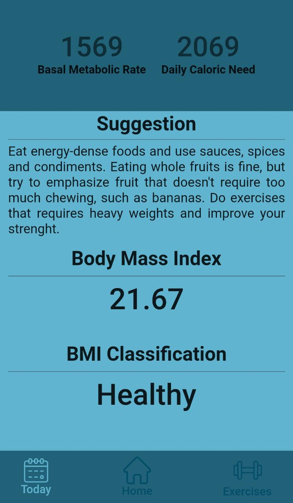
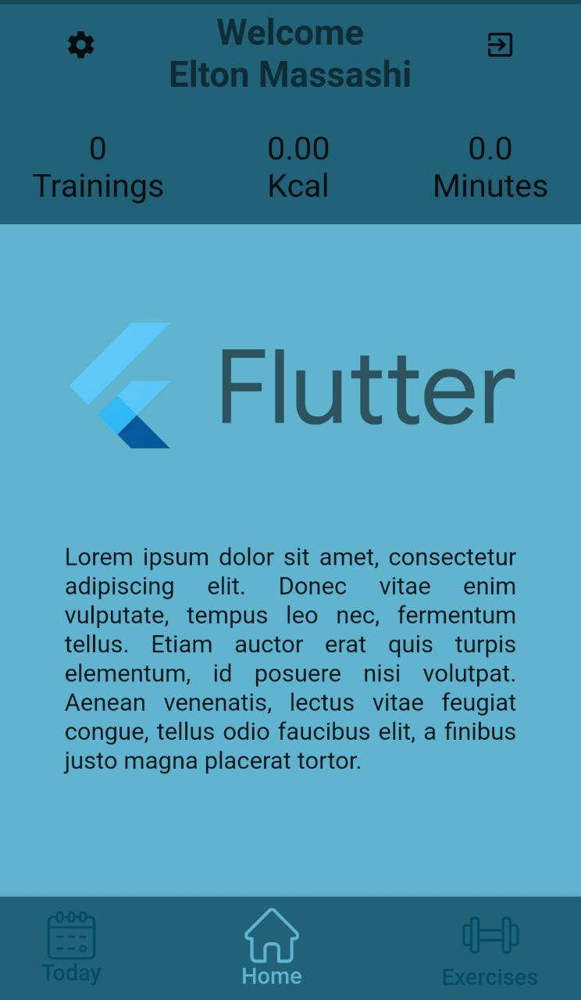
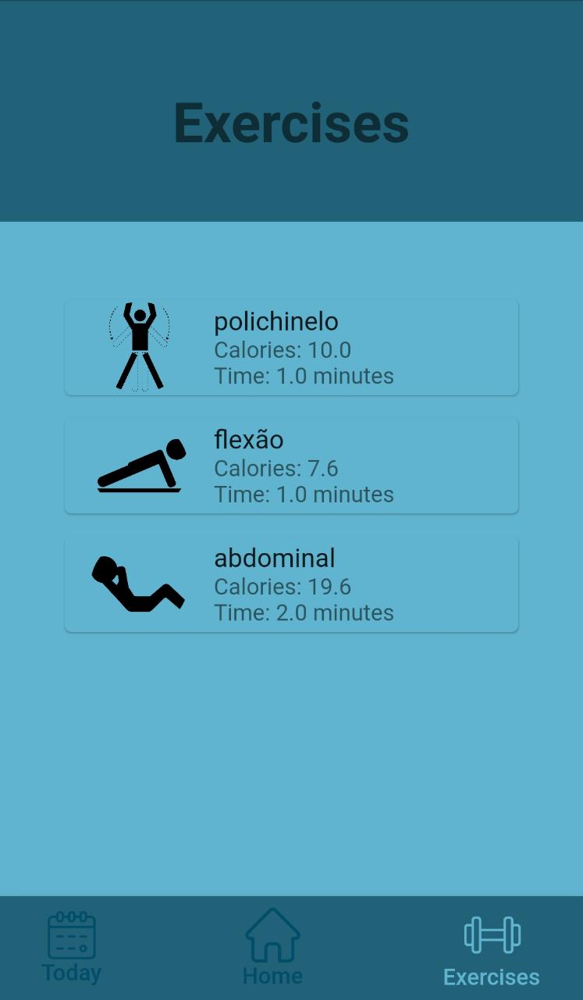
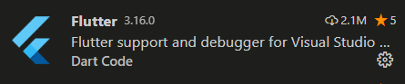

# Good Caloric Burn

Good Caloric Burn is a simple physical analysis flutter application developed by the student Elton Massashi Takeuchi in the subject of Mobile Development, in System Analysis and Development course from Universidade São Francisco (USF).

## Preview

  

## Installation

- Go to the [flutter get started page](https://flutter.dev/docs/get-started/install) and follow the installation tutorial for the flutter dependencies.
- Setup VSCode to work with flutter by downloading the extension: 

    
- Setup your phone or an android emulator to run the app.
- Select the device on VSCode.
- Clone the repository.
- Open a terminal on the root of the project and run the run command:

```bash
flutter run
```

## License
[MIT](./LICENSE)
